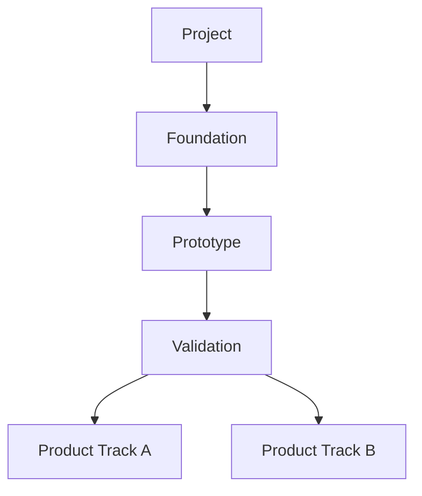
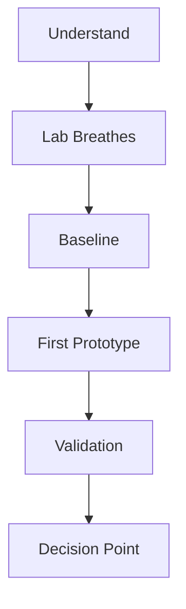

# Roadmap

## North Star Map

## Experiment Ladder

## Current Stage

Current active stage: `S0 - Understand`

## Stage Status Table

| Stage | Status | Evidence Needed | Decision Gate |
|---|---|---|---|
| S0 Understand | Active | Project brief complete | Is the goal clear? |
| S1 Lab Breathes | Pending | Repeatable loop | Can we measure? |
| S2 Baseline | Pending | Baseline metrics | What is the current gap? |
